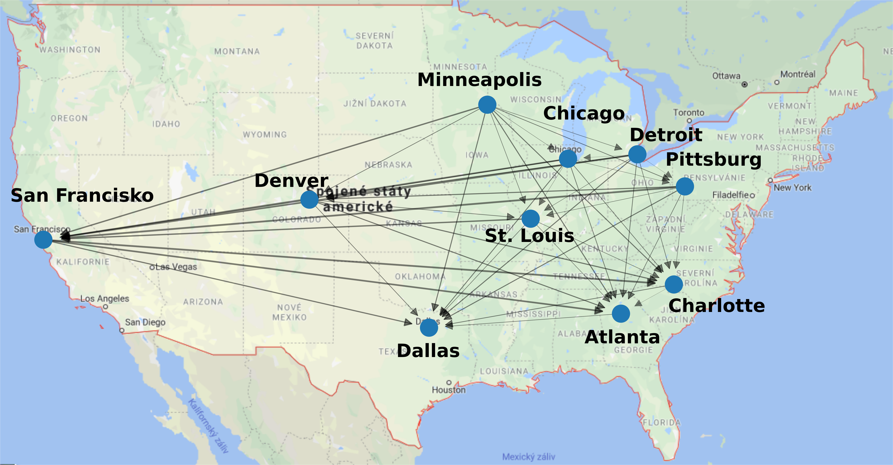

% Analysis of USAir97 network 
% Zuzana Drázdová & Zuzana Šimečková 
% January 7 2020 
# General information 
US Air 97 Network has **332** nodes and **2126** edges.

Nodes represent Airports in the United States and edges represent routes between these airtports.

Each edge has weights with indicated how many flights are on given route.

# Top US airports 
**Top ten airports with flights to/from most other airports:** 

* Chicago O'hare Intl

* Dallas/Fort Worth Intl

* The William B Hartsfield Atlan

* Pittsburgh Intll

* Lambert-St Louis Intl

* Charlotte/Douglas Intl

* Stapleton Intl

* Minneapolis-St Paul Intl/Wold-

* Detroit Metropolitan Wayne Cou

* San Francisco Intl

# Top US airports 

# Top US airports 
**Top ten airports with most flights:** 

* Chicago O'hare Intl

* Dallas/Fort Worth Intl

* Los Angeles Intl

* Minneapolis-St Paul Intl/Wold-

* The William B Hartsfield Atlan

* Seattle-Tacoma Intl

* Stapleton Intl

* San Francisco Intl

* Lambert-St Louis Intl

* Newark Intl

# Centralities 

### In degree centrality: 
* Chicago O'hare Intl: 0.12084592145015105

* **Dallas/Fort Worth Intl: 0.2326283987915408**

* Los Angeles Intl: 0.1268882175226586

* Minneapolis-St Paul Intl/Wold-: 0.04229607250755287

* The William B Hartsfield Atlan: 0.1933534743202417

* Seattle-Tacoma Intl: 0.02416918429003021

* Stapleton Intl: 0.11178247734138973

* San Francisco Intl: 0.11178247734138973

* Lambert-St Louis Intl: 0.13595166163141995

* Newark Intl: 0.060422960725075525

# Centralities 

### Out degree centrality: 
* **Chicago O'hare Intl: 0.2990936555891239**

* Dallas/Fort Worth Intl: 0.12386706948640483

* Los Angeles Intl: 0.0513595166163142

* Minneapolis-St Paul Intl/Wold-: 0.1933534743202417

* The William B Hartsfield Atlan: 0.11178247734138973

* Seattle-Tacoma Intl: 0.14803625377643503

* Stapleton Intl: 0.14501510574018128

* San Francisco Intl: 0.09365558912386707

* Lambert-St Louis Intl: 0.14803625377643503

* Newark Intl: 0.1419939577039275

# Centralities 

### Degree centrality: 
* **Chicago O'hare Intl: 0.4199395770392749**

* Dallas/Fort Worth Intl: 0.3564954682779456

* Los Angeles Intl: 0.1782477341389728

* Minneapolis-St Paul Intl/Wold-: 0.23564954682779457

* The William B Hartsfield Atlan: 0.30513595166163143

* Seattle-Tacoma Intl: 0.17220543806646527

* Stapleton Intl: 0.256797583081571

* San Francisco Intl: 0.2054380664652568

* Lambert-St Louis Intl: 0.283987915407855

* Newark Intl: 0.20241691842900303

# Centralities 

### Closeness centrality: 
* **Chicago O'hare Intl: 0.6073394495412844**

* Dallas/Fort Worth Intl: 0.5544388609715243

* Los Angeles Intl: 0.5245641838351822

* Minneapolis-St Paul Intl/Wold-: 0.5399673735725938

* The William B Hartsfield Atlan: 0.5355987055016181

* Seattle-Tacoma Intl: 0.5262321144674086

* Stapleton Intl: 0.5245641838351822

* San Francisco Intl: 0.533011272141707

* Lambert-St Louis Intl: 0.5287539936102237

* Newark Intl: 0.4932935916542474

