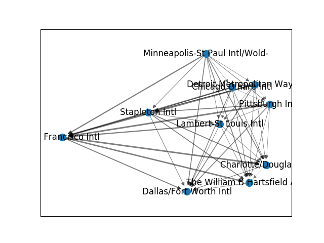

% Analysis of USAir97 network 
% Zuzana Drázdová & Zuzana Šimečková 
% January 7 2020 
# General information 
US Air 97 Network has **332** nodes and **2126** edges.
Nodes represent Airports in the United States and edges represent routes between these airtports. Each edge has weights with indicated how many flights are on given route
# Top US airports 
**Top ten airports with most flights:** 

* Chicago O'hare Intl

* Dallas/Fort Worth Intl

* The William B Hartsfield Atlan

* Pittsburgh Intll

* Lambert-St Louis Intl

* Charlotte/Douglas Intl

* Stapleton Intl

* Minneapolis-St Paul Intl/Wold-

* Detroit Metropolitan Wayne Cou

* San Francisco Intl

# Top US airports 
