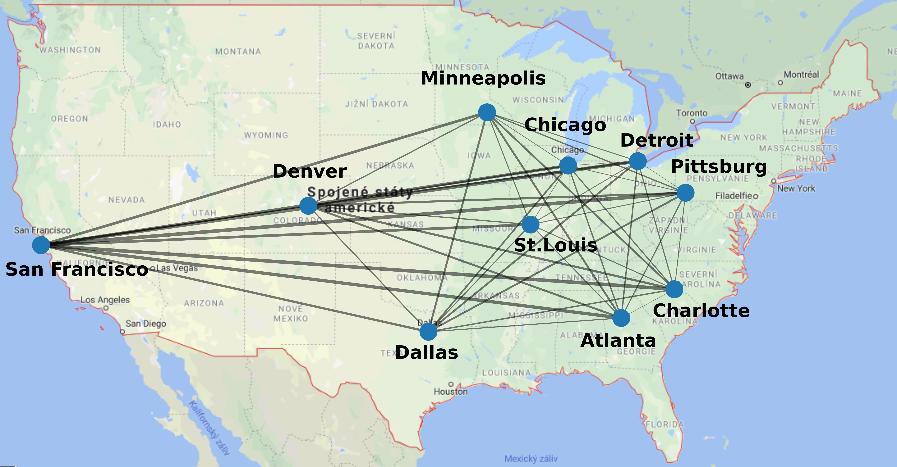
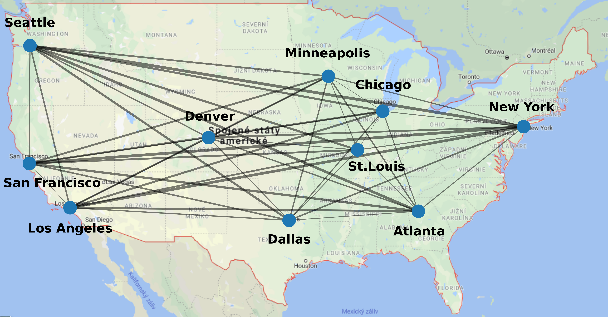
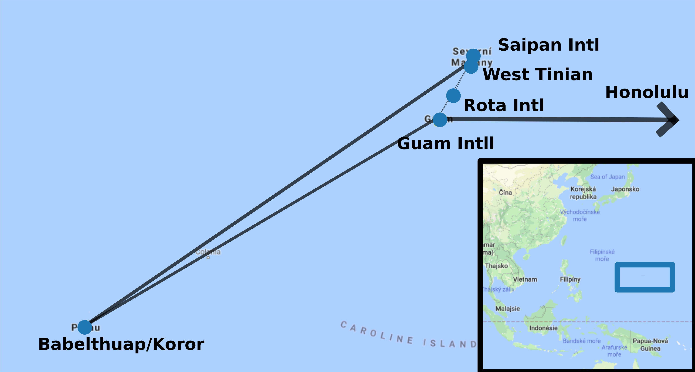
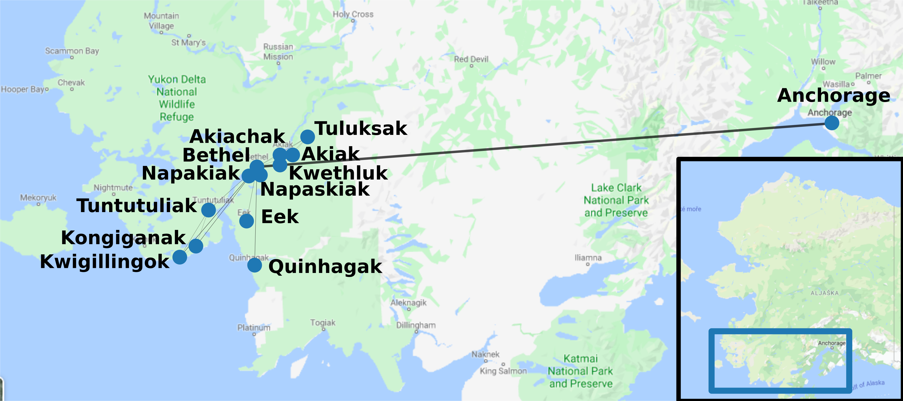
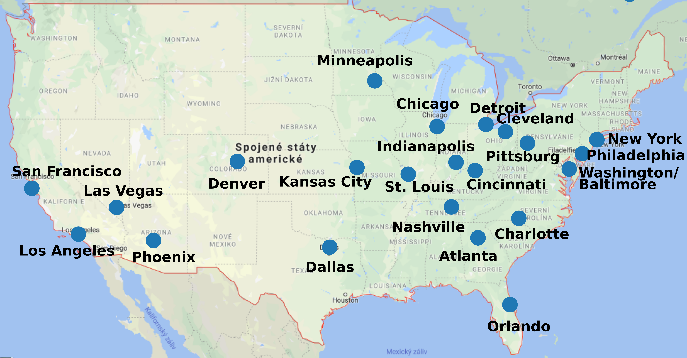

% Analysis of USAir97 network 
% Zuzana Drázdová & Zuzana Šimečková 
% January 7 2020 
# General information 
US Air 97 Network has **332** nodes and **2126** edges.

Data are from company US Airways, from year 1997.

Nodes represent Airports in the United States and edges represent routes between these airtports.

Each edge has weights with indicated how many flights were on given route.

Each node has *x* and *y* coordinates that can be mapped to the geographical location of the airport.

# Top US airports 
**Top ten airports with flights to/from most other airports:** 

* Chicago O'hare Intl

* Dallas/Fort Worth Intl

* The William B Hartsfield Atlan

* Pittsburgh Intll

* Lambert-St Louis Intl

* Charlotte/Douglas Intl

* Stapleton Intl

* Minneapolis-St Paul Intl/Wold-

* Detroit Metropolitan Wayne Cou

* San Francisco Intl

# Top US airports 

# Top US airports 
**Top ten airports with most flights:** 

* Chicago O'hare Intl

* Dallas/Fort Worth Intl

* Los Angeles Intl

* Minneapolis-St Paul Intl/Wold-

* The William B Hartsfield Atlan

* Seattle-Tacoma Intl

* Stapleton Intl

* San Francisco Intl

* Lambert-St Louis Intl

* Newark Intl

# Top US airports 

# Centralities 

### Degree centrality: 
* **Chicago O'hare Intl: 0.4199395770392749**

* Dallas/Fort Worth Intl: 0.3564954682779456

* Los Angeles Intl: 0.1782477341389728

* Minneapolis-St Paul Intl/Wold-: 0.23564954682779457

* The William B Hartsfield Atlan: 0.30513595166163143

* Seattle-Tacoma Intl: 0.17220543806646527

* Stapleton Intl: 0.256797583081571

* San Francisco Intl: 0.2054380664652568

* Lambert-St Louis Intl: 0.283987915407855

* Newark Intl: 0.20241691842900303

# Centralities 

### Closeness centrality: 
* **Chicago O'hare Intl: 0.6073394495412844**

* Dallas/Fort Worth Intl: 0.5544388609715243

* Los Angeles Intl: 0.5245641838351822

* Minneapolis-St Paul Intl/Wold-: 0.5399673735725938

* The William B Hartsfield Atlan: 0.5355987055016181

* Seattle-Tacoma Intl: 0.5262321144674086

* Stapleton Intl: 0.5245641838351822

* San Francisco Intl: 0.533011272141707

* Lambert-St Louis Intl: 0.5287539936102237

* Newark Intl: 0.4932935916542474

# Centralities 

### Edge betweenness: 
* Anchorage Intl -- Chicago O'hare Intl: 0.05020853263354335

* Anchorage Intl -- Los Angeles Intl: 0.012798272676311534

* Anchorage Intl -- San Francisco Intl: 0.018803926543685387

* Anchorage Intl -- Detroit Metropolitan Wayne Cou: 0.017291165030171723

* Anchorage Intl -- Minneapolis-St Paul Intl/Wold-: 0.01844483276908697

* Anchorage Intl -- Seattle-Tacoma Intl: 0.012622179299409222

* Anchorage Intl -- Salt Lake City Intl: 0.014831607119189455

* Anchorage Intl -- Bethel: **0.0694500054599061**

* Juneau Intl -- Seattle-Tacoma Intl: 0.015151054817792723

* Honolulu Intl -- Guam Intll: 0.02975648818840316

# Graph diameter 
Social networks have small diameter 

Random network with the same amount of nodes and edges has diameter **4** 

Our network has diameter **6**

 * Number of routes with max shortest length: **56** 
 * All of them start: *West Tinian* - *Saipan* - *Guam* - *Honolulu*
 * Most of them end: *Anchorage* - *Bethel* - *SAT*
 * Where SAT stands for Small Alaskan Town = {Tuluksak, Akiachak, Akiak, Kwethluk, Napaskiak, Napakiak, Tuntutuliak, Eek, Kongiganak, Kwigillingok, Quinhagak}

# Islands in Pacific Ocean

# Small Alaskan Towns

# Other properties 
Radius of the graph: **3** 

Density of the graph: **0.0386925344884068** 

Density of the graph of top airports: **1.0** 

US Air 97 is **connected** network. 

It has **56** bridges. 

Most important bridge is **Honolulu Intl** to **Guam Intll**. 

Maximal degree is **139**. 

Minimal degree is **1**. 

Average degree is **12.80722891566265**. 

# Max clique 
Size of max clique: **22**

# Small world effect 
Social networks tend to be characterized by very short paths between randomly chosen pairs of people.

 We compared average shortes path length in our graph and randomly generated graph with the same amount of nodes and edges. 

US Air 97: **2.7381247042550867** 

Random graph: **2.556127834601245**

***Small world effect not present***

# Power-law degree distribution 
Random graph - homogenous degree distribution -> Binomial degree distribution 

Real world network - heterogenous degree distribution -> **Power-law degree** distribution 

 * many nodes with only few neighbors 

 * few hubs with large number of links 

**Our graph has power-law degree distribution** see next slides 

# Degree distribution: UsAir97 

# Degree distribution: RandomGraph 
